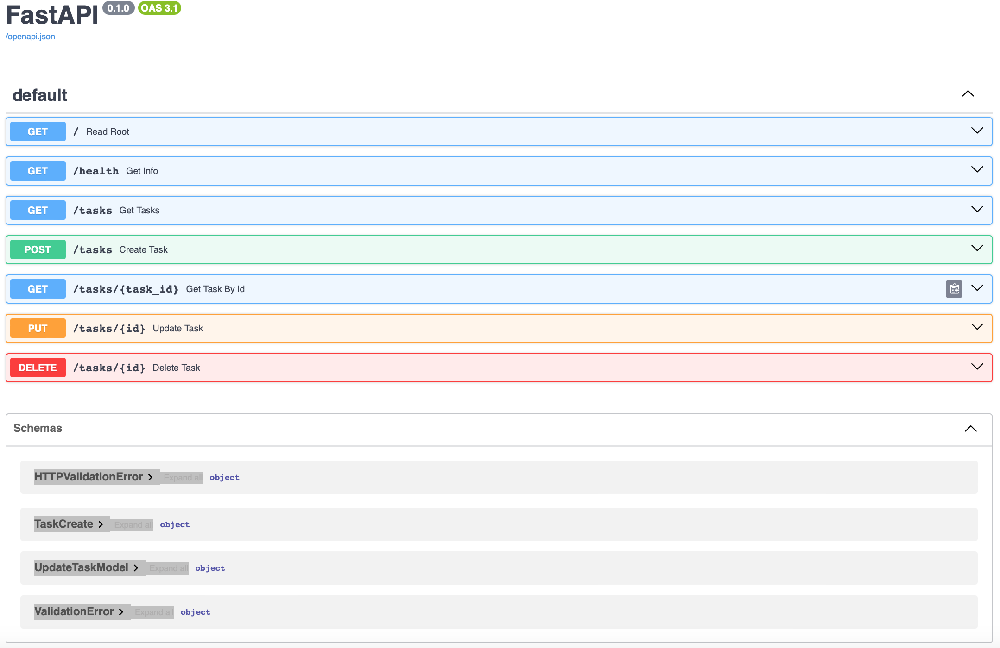

# CRUD application
Here is a small CRUD application build with FastAPI to demonstrate what can be done with this tool. It has a list of tasks initially (as list of dictionaries), the user can get the list, details of a particular task, add a new task, edit it or/and delete. 

The command to launch it is just 
```
python main.py
```

## Documentation
At http://localhost:8000/docs will be available description of all endpoints.


## Testing
How to test with "curl":
```
curl -i -X POST http://localhost:8000/tasks \     
     -H "Content-Type: application/json" \
     -d '{"title": "    "}'
```
HTTP/1.1 400 Bad Request
date: Mon, 20 Jul 2026 11:35:59 GMT
server: uvicorn
content-length: 57
content-type: application/json
{"detail":"Title cannot be empty or contain only spaces"}% 

```
curl -i -X POST http://localhost:8000/tasks \ 
     -H "Content-Type: application/json" \
     -d '{"title": "Buy milk"}'
```
HTTP/1.1 201 Created
date: Mon, 20 Jul 2026 11:36:29 GMT
server: uvicorn
content-length: 40
content-type: application/json
{"id":4,"title":"Buy milk","done":false}%

In order to test PUT and DELETE following curl-strings can be used:
```
curl -X PUT "http://localhost:8000/tasks/4" -H "Content-Type: application/json" -d '{"title": "Byu milk and eggs", "done": true}'

curl -i -X DELETE http://localhost:8000/tasks/4 
```